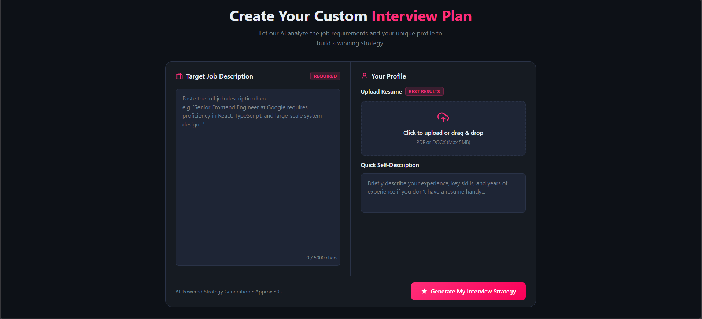
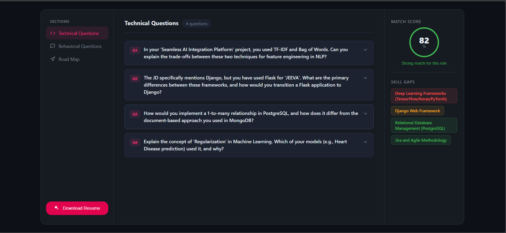

<div align="center">

# 🧠 Medha — AI Interview Preparation Strategist

### *Transforming Resume + Job Descriptions into Personalized Interview Success Roadmaps*

<p align="center">
  
  
  
  
</p>

### 🚀 Prepare Smarter. Interview Better. Get Hired Faster.

**Medha** is an AI-powered interview preparation platform that analyzes your **resume** and a **target job description** to generate personalized preparation strategies, mock interviews, skill-gap insights, and ATS-optimized resumes.

---

### ⚡ Why Medha?

Traditional interview prep is generic.  
Medha makes it **personalized, strategic and AI-driven.**

✅ Identify missing skills  
✅ Simulate job-specific interviews  
✅ Generate preparation roadmaps  
✅ Build ATS-optimized resumes  
✅ Practice exactly what recruiters may ask

</div>

---

# ✨ Features

## 🎯 Personalized Interview Roadmap
Upload your resume + target job description and receive:

- Day-by-day preparation plan
- Topic prioritization roadmap
- Role-specific study strategy
- Technical + behavioral focus areas

---

## 💬 AI Interview Simulator
Practice with dynamic interview questions generated from your profile.

### Includes:
- Technical Questions  
- Behavioral Questions  
- HR Questions  
- Model Answers  
- Interviewer Intent Explanation  

---

## 📊 Skill Gap Analyzer
Discover what your resume is missing compared to job requirements.

| Severity | Meaning |
|---------|---------|
| 🟢 Low | Minor improvements |
| 🟡 Medium | Important skills missing |
| 🔴 High | Critical gap affecting eligibility |

---

## 📄 ATS Resume Generator
Generate recruiter-friendly resumes optimized for:

- ATS Screening
- Keyword Matching
- Role Alignment
- Professional PDF Export

---

## 🔐 Secure Authentication
- JWT Authentication  
- Bcrypt Password Hashing  
- Protected User Reports  
- Private Dashboard Access  

---

# 🖼️ Product Preview


## Home Page



## Result Page



---

# 🛠 Tech Stack

## Frontend
| Technology | Purpose |
|----------|---------|
React (Vite) | UI Framework |
SCSS/SASS | Styling |
React Router | Routing |
Axios | API Requests |

---

## Backend
| Technology | Purpose |
|----------|---------|
Node.js | Runtime |
Express.js | Server |
MongoDB | Database |
Mongoose | ODM |
Google Gemini | AI Engine |
Puppeteer | PDF Generation |
pdf-parse | Resume Parsing |

---

# 🧠 System Workflow

```text
Resume Upload
   ↓
Job Description Parsing
   ↓
Gemini AI Analysis
   ↓
Skill Gap Detection
   ↓
Interview Questions + Prep Roadmap
   ↓
ATS Resume Optimization
```

---

# 🚀 Getting Started

## 1 Clone Repository

```bash
git clone https://github.com/yourusername/medha.git
cd medha
```

---

## 2 Backend Setup

```bash
cd Backend
npm install
cp .env.example .env
```

Add environment variables:

```env
MONGO_URI=your_mongodb_uri
JWT_SECRET=your_secret
GOOGLE_GENAI_API_KEY=your_api_key
```

Run server:

```bash
npm run dev
```

Backend runs on:

```bash
http://localhost:3000
```

---

## 3 Frontend Setup

```bash
cd Frontend
npm install
npm run dev
```

Frontend runs on:

```bash
http://localhost:5173
```

---

# 📂 Project Structure

```bash
Medha/
├── Frontend/
│   ├── components/
│   ├── pages/
│   └── services/
│
├── Backend/
│   ├── controllers/
│   ├── routes/
│   ├── models/
│   └── utils/
```

---

# 🌟 Future Roadmap

- [ ] Voice-based mock interviews  
- [ ] AI Interview Feedback Scoring  
- [ ] Company-wise question banks  
- [ ] Coding interview simulator  
- [ ] Interview performance analytics

---


### Built with ❤️ to help developers crack dream jobs.

If you like this project, give it a ⭐ on GitHub.

</div>